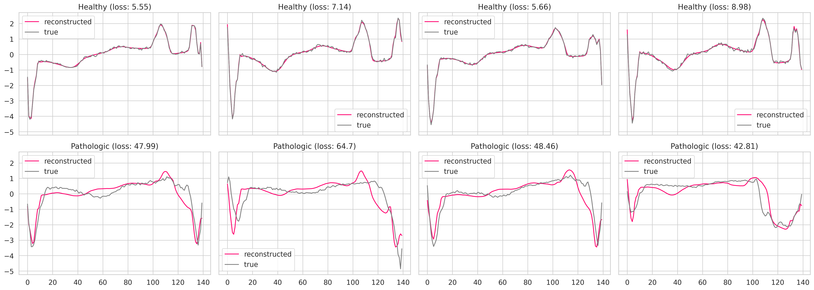

# anomaly_detection_LSTM

According to the data [source](http://www.timeseriesclassification.com/description.php?Dataset=ECG5000), the best reported accuracy is 0.9461 [source](https://dl.acm.org/doi/10.1007/s10618-014-0388-4).

**The method in this script achieves a 0.98 accuracy, 0.97 AUC, and 0.98 F1 score, with little variation as determined by 10-fold cross-validation.** However, since training and test splits were not identical to the [paper](https://dl.acm.org/doi/10.1007/s10618-014-0388-4), these results cannot be directly compared. Despite not being able to draw direct comparisons, the LSTM in this script can differentiate pathologic from healthy ECG traces with high precision and recall. Therefore, this model and approach appear promising for use in various settings, including wearable health sensors and electronics. Of course, more studies are needed to ensure the model scales to any other setting and data outside of the used ECG5000 dataset.

**Stats:**
ROC AUC: 0.97, ± 0.02
PR AUC: 0.98, ± 0.01
Acc: 0.98, ± 0.01
F1 score: 0.98, ± 0.01
